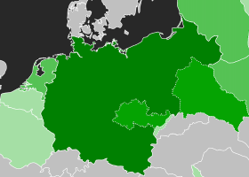
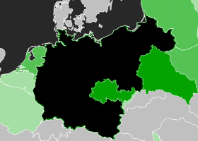
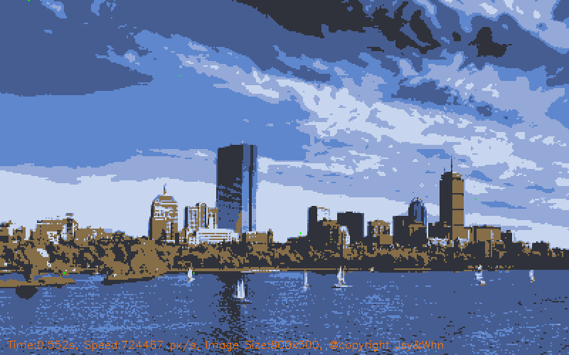
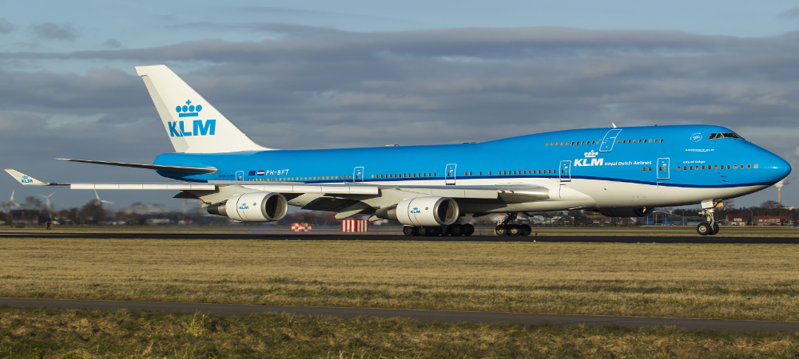
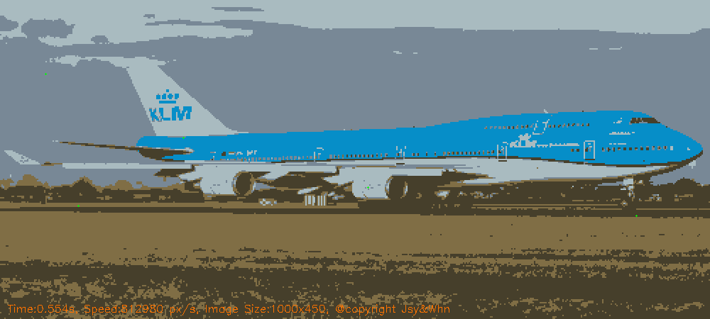
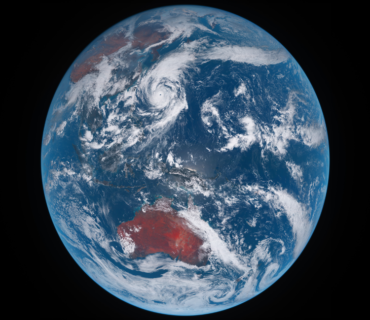
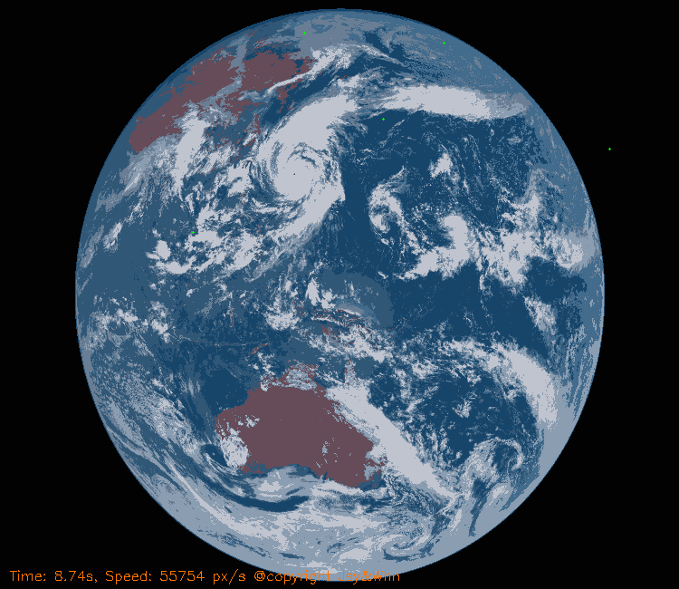

# Image Segmentation using Network Flow

## Foreground Segmentation Results:

|  |  | |
|------------------------|------------------------|-------------------|
| Original Image   | Foreground Image    | Background Image |

## K Segmentations:

||  |
|------------------------|------------------------|
| Original Image：  | K Segmentations Image(K=6)    | 

| |  |
|------------------------|------------------------|
 Original Image：  | K Segmentations Image(K=4)    | 

| |  |
|------------------------|------------------------|
 Original Image：  | K Segmentations Image(K=5)    | å

# How to run the codes:
## Dependencies: 
- ### g++/ gcc/ Clang 
- ### Opencv
- ### Right path to your file
## Project Structure:
#### |___ .vscode/tasks.json        
#### |___ .vscode/c_cpp_properties.json            
#### |___ Pictures         
#### |___ output  
#### |___ V2.0_K_Segmentations.cpp
## Terminal codes:
- [Crtl + Shift +B]to compile the codes
- ./outputs
## Segmentataion Flow Map :

  

