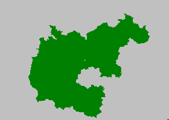

# Image Segmentation using Network Flow

## 2 Segmentation Results:

|  |  | |
|------------------------|------------------------|-------------------|
| Original Image   | Foreground Image    | Background Image |

## K Segmentations:

|  |  |
|------------------------|------------------------|
| Original Image   | Foreground Image    | 

## Segmentataion Flow Map :

  

