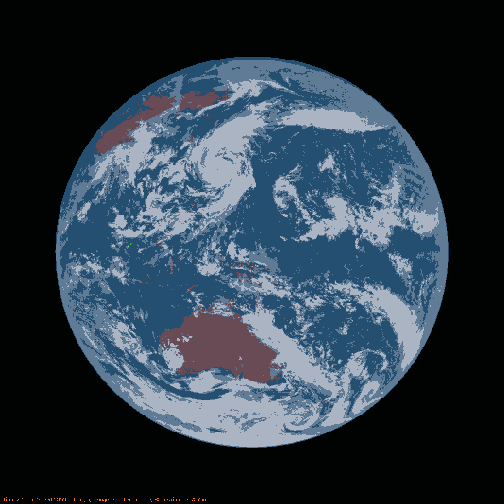

# Image Segmentation using Network Flow

## Segmentation Results:

|  |  | |
|------------------------|------------------------|-------------------|
| Original Image   | Foreground Image    | Background Image |

## Segmentataion Flow Map :

  

