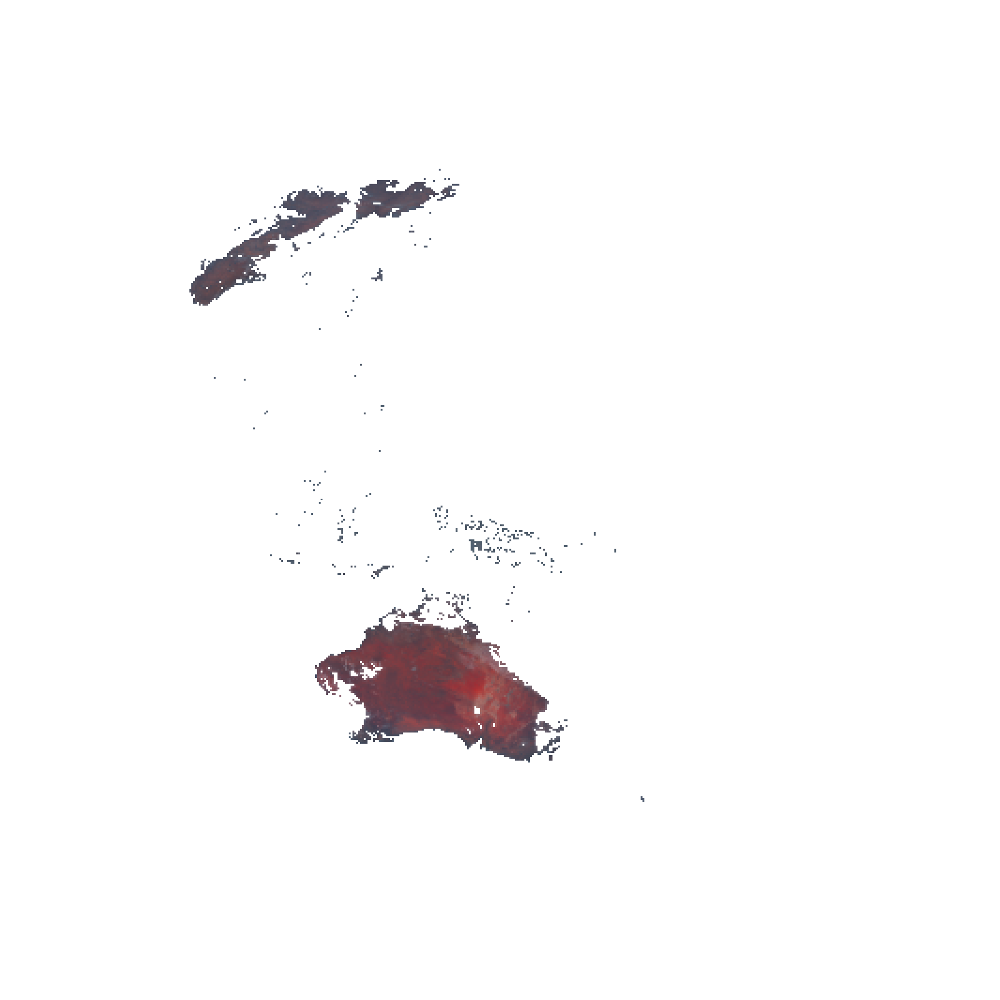

# Image Segmentation using Network Flow

## Foreground Segmentation Results:

|  |  | 
|------------------------|------------------------|
| Original Image   | Foreground Image    |

## K Segmentations:

| |  |
|------------------------|------------------------|
 Original Image：  | K Segmentations Image(K=5)    | 

||  |
|------------------------|------------------------|
| Original Image：  | K Segmentations Image(K=6)    | 

| |  |
|------------------------|------------------------|
 Original Image：  | K Segmentations Image(K=7)    | 
 
| |  |
|------------------------|------------------------|
Layer:Clouds  |   Layer:Land  | 

# How to run the codes:
## Dependencies: 
- ### g++/ gcc/ Clang 
- ### Opencv
- ### Right path to your file
## Project Structure:
#### |___ .vscode/tasks.json        
#### |___ .vscode/c_cpp_properties.json            
#### |___ Pictures         
#### |___ output  
#### |___ V2.0_K_Segmentations.cpp
## Terminal codes:
- [Crtl + Shift +B]to compile the codes
- ./outputs
## Segmentataion Flow Map :

  

## Acknowledgmens
[Haonan Wu](https://github.com/HaonanWu17) & [Mingdong Zhou](https://github.com/mzou12)
